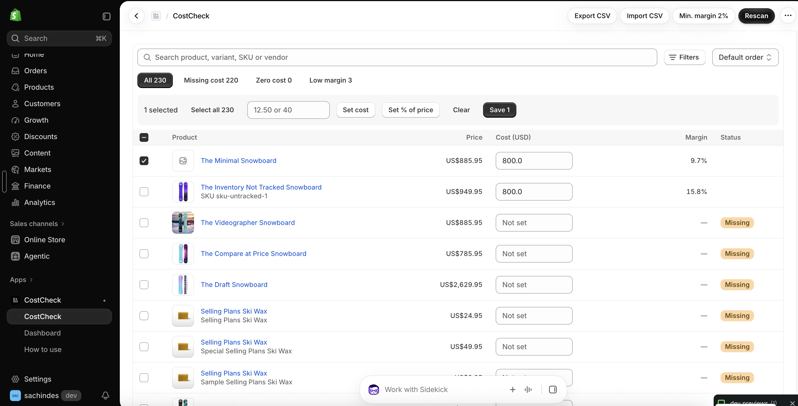
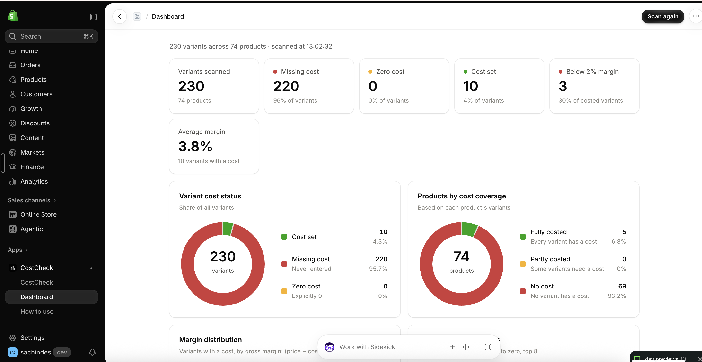
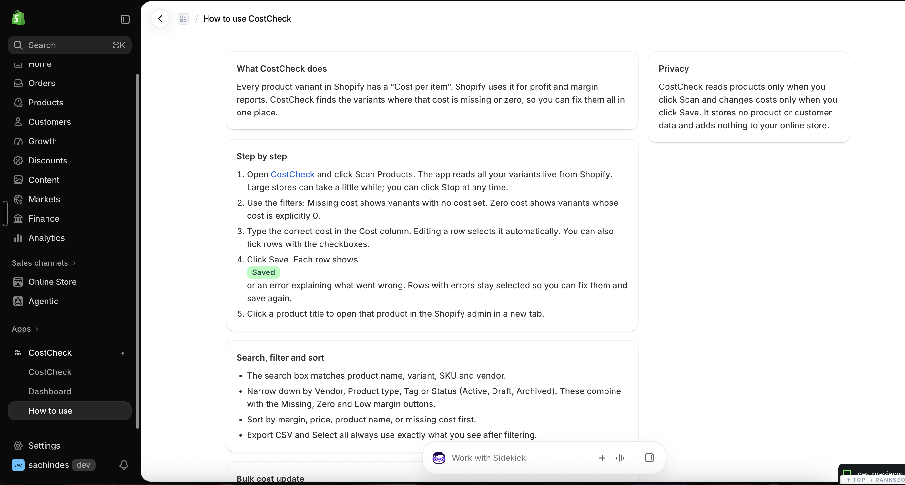

<div align="center">

# CostCheck

**Find and fix Shopify products with missing or zero cost, in bulk.**

A free, open-source, lightweight embedded Shopify app. It scans your catalog, shows which variants have no "Cost per item" (or a cost of 0), and lets you fix them one by one, in bulk, or from a CSV. It also flags low-margin products.




</div>

---

## Why

Shopify uses each variant's **Cost per item** for profit and margin reports. When costs are missing, those reports are wrong. When a cost was set to `0` by mistake, they look better than reality. In a big catalog, finding these variants by hand is painful.

CostCheck puts every variant on one screen, separates **missing** costs from **explicit zero** costs (zero is never treated as missing), and lets you fix them quickly.

## Features

| | |
|---|---|
| 🔍 **Scan on demand** | Reads all variants live through the GraphQL Admin API, with cursor pagination and rate-limit handling. Nothing is copied to a database. |
| 🧾 **Clear table** | Product image, title, variant, SKU, price, editable cost, margin and status. Each title links to the product in your admin. |
| 🚦 **Smart filters** | Missing cost · Zero cost · Low margin, plus search (title, variant, SKU, vendor) and filters by vendor, product type, tag and status. |
| ↕️ **Sorting** | By margin, price, product name, or missing cost first. |
| ⚡ **Bulk update** | Give all selected rows the same cost, or set cost as a **% of price**. Example: every product from one vendor at 45% of price. |
| 📄 **CSV import / export** | Export the current view, edit it in a spreadsheet, and import it back. A supplier sheet with `sku` + `cost` columns, or Shopify's own product export, also works. You see a full **preview** before anything is saved. |
| 📉 **Low-margin warning** | Set a minimum margin. Rows below it turn red and show the **minimum price** that would reach it. |
| ↩️ **Undo** | Undo the last save, including resetting costs that were not set before. |
| ⌨️ **Keyboard entry** | Enter / ↓ moves to the next cost field, Shift+Enter / ↑ to the previous one. |
| ✅ **Per-row results** | Every save shows *Saved* or a clear error on that exact row. |
| 📊 **Dashboard** | Stat tiles, donut charts for cost status and product coverage, margin distribution, and the products that need costs first. |
| 🌍 **Currency aware** | Validates non-negative decimals with the right number of decimals for the store currency (USD 2, JPY 0, KWD 3). |

<table>
  <tr>
    <td width="50%"></td>
    <td width="50%"></td>
  </tr>
  <tr>
    <td align="center"><b>Dashboard</b></td>
    <td align="center"><b>Built-in "How to use" guide</b></td>
  </tr>
</table>

## Lightweight by design

- **Doesn't touch your storefront.** No theme code, script tags, pixels or app blocks, so it has zero impact on store speed.
- **Minimal permissions:** `read_products` and `write_inventory` only.
- **No product or customer data stored.** Scans live in browser memory. The only things stored are the Shopify auth session (required by Shopify) and the minimum-margin setting, kept as an app-data metafield on your store.
- **No tracking or analytics, no third-party services, no background jobs.**
- **Small:** about 96 KB of compressed JavaScript for the whole admin UI. Charts are hand-made SVG with no chart library.
- Implements Shopify's mandatory privacy webhooks with HMAC verification.

## Use it on your store

CostCheck is not listed on the Shopify App Store. You run your own copy for free, as a **custom app** on your store. You need:

- [Node.js](https://nodejs.org) 20.19+ or 22.12+
- A free [Shopify Partner / Dev Dashboard](https://dev.shopify.com) account
- The store you want to use it on (or a free development store to try it first)

### 1. Get the code

```bash
git clone https://github.com/Sachinsagarmishra/costcheck_shopify_app.git
cd costcheck_shopify_app
npm install
```

Shopify CLI is a local dev dependency, so nothing is installed globally. The npm cache is kept next to the project (see `.npmrc`).

### 2. Run it locally

```bash
npm run dev
```

The first run asks you to:

1. **Log in** to your Shopify Partner account in the browser.
2. **Create a new app.** Choose *Yes, create it as a new app* and call it anything, for example `CostCheck`. This creates **your own** app and writes your `client_id` into `shopify.app.toml`.
3. **Pick a store.**
4. Press **`p`** to open the app and **install** it.

The CLI starts a secure tunnel, so the app opens inside your Shopify admin under **Apps → CostCheck**.

> Keep the terminal open while you use it. To stop, press `Ctrl+C`. Run `npm run dev` only once at a time.

### 3. Deploy it so it runs 24/7 (optional)

Any Node host works, for example Render, Fly.io, Railway or a VPS. A `Dockerfile` is included.

1. **Database for sessions.** SQLite is fine locally. For a host, use PostgreSQL (a free [Neon](https://neon.tech) database works). In `prisma/schema.prisma`:
   ```prisma
   datasource db {
     provider = "postgresql"
     url      = env("DATABASE_URL")
   }
   ```
   Then delete `prisma/migrations/` and run `DATABASE_URL="postgresql://..." npx prisma migrate dev --name init`.
2. **Host settings**
   - Build: `npm install && npm run build`
   - Start: `npm run docker-start`
   - Environment variables:

   | Variable | Value |
   |---|---|
   | `NODE_ENV` | `production` |
   | `SHOPIFY_API_KEY` | your app's Client ID (`npm run shopify -- app env show`) |
   | `SHOPIFY_API_SECRET` | your app's Client secret |
   | `SHOPIFY_APP_URL` | your public URL, e.g. `https://costcheck.example.com` |
   | `SCOPES` | `read_products,write_inventory` |
   | `DATABASE_URL` | your Postgres connection string |

3. **Point Shopify to it.** Set `application_url` and `[auth] redirect_urls` (`https://YOUR-URL/auth/callback`) in `shopify.app.toml`, then run:
   ```bash
   npm run deploy
   ```
4. In the Dev Dashboard, open your app → **Distribution** → **Custom distribution**, and generate an install link for your store.

## How it works

```
Shopify admin (iframe)
   │  App Bridge adds a session token to every fetch
   ▼
app/routes/app._index.tsx ── POST /api/costs ──▶ app/routes/api.costs.tsx
   (table, filters, CSV,                           │ authenticate.admin()
    bulk, undo)                                    ▼
                                         app/lib/costcheck.server.ts
                                           • productVariants (250 per page)
                                           • inventoryItemUpdate (25 per request, aliased)
                                           • throttle-aware retries (THROTTLED, 429, 503)
```

- **Scan:** `productVariants(first: 250, after: $cursor)` with product title, vendor, type, tags, status, image, price, SKU and `inventoryItem.unitCost`. The page keeps requesting pages until `hasNextPage` is false.
- **Save:** aliased `inventoryItemUpdate(id, input: { cost })` mutations. `userErrors` are mapped back to each row. `cost: null` clears a cost (used by Undo).
- **Rate limits:** reads `extensions.cost.throttleStatus` and waits before the bucket runs dry. `THROTTLED` errors are retried after the bucket refills.
- **Settings:** the minimum margin is an app-data metafield on the `AppInstallation` (`metafieldsSet`), so no extra scope or database table is needed.

### Project structure

| Path | What's inside |
|---|---|
| `app/routes/app._index.tsx` | Main CostCheck page: table, filters, sorting, bulk bar, CSV, undo, keyboard navigation |
| `app/routes/app.dashboard.tsx` | Dashboard with stat tiles and charts |
| `app/routes/app.help.tsx` | In-app "How to use" guide |
| `app/routes/api.costs.tsx` | JSON endpoint: `scan`, `save`, `settings` |
| `app/lib/costcheck.server.ts` | GraphQL queries and mutations, throttling, settings metafield |
| `app/lib/money.ts` | Currency-aware validation, margin and price math |
| `app/lib/csv.ts`, `app/lib/cost-import.ts` | Dependency-free CSV parse/export and import matching |
| `app/components/Charts.tsx` | SVG donut, column, bar-list and stat tile components |
| `app/routes/webhooks.*.tsx` | Uninstall, scope update and privacy compliance webhooks |

Built on the official [Shopify React Router app template](https://github.com/Shopify/shopify-app-template-react-router), with Polaris web components, App Bridge, and Prisma session storage.

## Development

```bash
npm run dev         # run inside your Shopify admin with a tunnel
npm run typecheck   # TypeScript
npm run lint        # ESLint
npm run build       # production build
```

## Contributing

Issues and pull requests are welcome. Ideas on the roadmap:

- Inventory value at cost (per location)
- Profit per order and margin of best sellers
- Shipping, packaging and payment fees in margin calculations
- Translations

Read the [contributing guide](CONTRIBUTING.md) to get started, and please follow the [Code of Conduct](CODE_OF_CONDUCT.md). Found a security issue? See [SECURITY.md](SECURITY.md) and report it privately.

## Support

Found a bug or have a question? [Open an issue](https://github.com/Sachinsagarmishra/costcheck_shopify_app/issues) or email **hi@sachindesign.com**.

## License

[MIT](LICENSE.md) © [Sachinsagarmishra](https://sachindesign.com). Based on the MIT-licensed Shopify app template.
